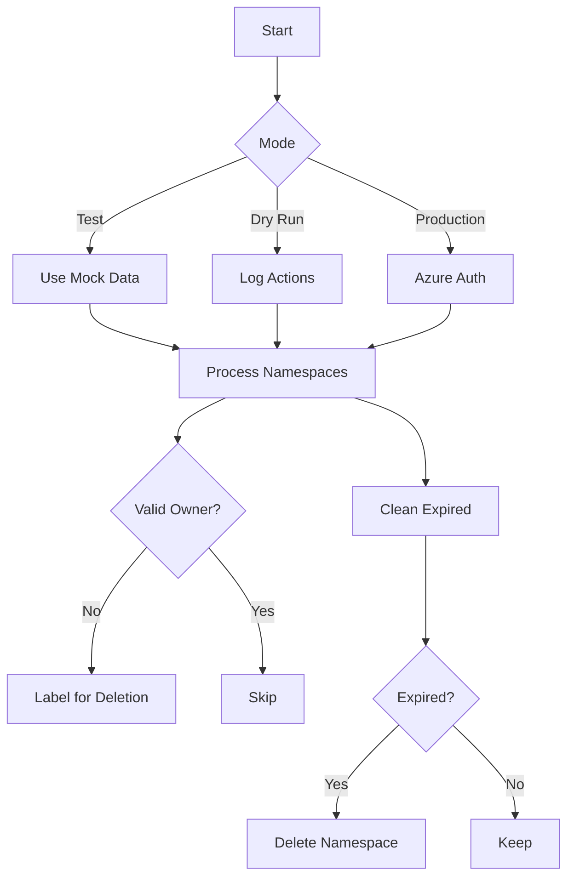

# Kubernetes Namespace Cleaner

A Kubernetes CronJob that automatically identifies and cleans up namespaces tied to deprovisioned Azure Entra ID (formerly Azure AD) users.



## Features

- 🏷️ Label-based namespace lifecycle management
- 🔒 Azure Entra ID integration
- 🧪 Local testing mode
- ☁️ Dry-run capability

## Quick Start

```bash
# 1. Clone repo
git clone https://github.com/bryanpaget/namespace-cleaner.git
cd namespace-cleaner

# 2. Test locally
make test # Full test suite with cleanup

# 3. Dry Run
make dry-run # Preview actions without execution

# 4. Deploy
make run  # Applies configmap/secret and starts CronJob

# 5. Stop CronJob
make stop  # Retains configs

# 6. Clean Expired Namespaces
make clean  # Removes all namespace-cleaner resources
```

## Command Reference

| Command          | Description                            |
|------------------|----------------------------------------|
| `make test`      | Run full test suite (local cluster)    |
| `make dry-run`   | Preview actions without execution      |
| `make run`       | Deploy to production                   |
| `make stop`      | Stop CronJob (retains configs)         |
| `make clean`     | Remove all namespace-cleaner resources |

## Configuration

**1. `configmap.yaml`** - Set allowed domains and grace period:
```yaml
data:
  config.env: |
    ALLOWED_DOMAINS="yourdomain.com"
    GRACE_PERIOD="30d"  # Format: <number>d
```

**2. `secret.yaml`** - Add Azure credentials:
```yaml
stringData:
  AZURE_TENANT_ID: <tenant-id>
  AZURE_CLIENT_ID: <client-id>
  AZURE_CLIENT_SECRET: <client-secret>
```

## Testing Guide

**Local Cluster Test**:
```bash
make test  # Creates → Labels → Deletes test namespaces
```

**CI/CD Integration**:
```yaml
# GitHub Actions snippet
- name: Test
  run: |
    make test
    make clean
```

---

## Troubleshooting

**Common Issues**:

```bash
# View cleaner logs
kubectl logs -l job-name=namespace-cleaner

# Check CronJob status
kubectl get cronjob namespace-cleaner -o wide

# Full reset
make stop && make clean && make run
```

**Error Reference**:

| Error                          | Solution                      |
|--------------------------------|-------------------------------|
| `Invalid domain`               | Update ALLOWED_DOMAINS        |
| `Azure login failed`           | Verify secret.yaml            |
| `Namespace not deleted`        | Check GRACE_PERIOD value      |
