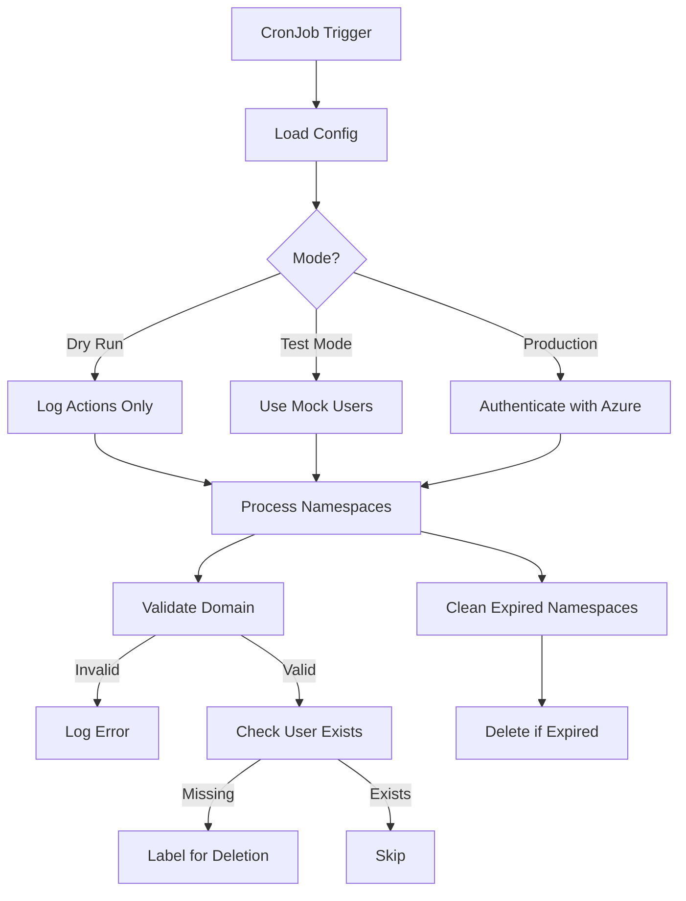

# Kubernetes Namespace Cleaner
Automatically marks and deletes Kubernetes namespaces if their owner no longer exists in Azure Entra ID.


## Features
- 🏷️ Label-based namespace lifecycle management
- 🔒 Azure Entra ID integration
- 🧪 Local testing mode
- ☁️ Dry-run capability

---

## Quick Start
```bash
# 1. Clone repo
git clone https://github.com/bryanpaget/namespace-cleaner.git
cd namespace-cleaner

# 2. Deploy
make run  # Applies configmap/secret and starts CronJob

# 3. Test locally
make test # Full test suite with cleanup
```

---

## Command Reference
| Command          | Description                          |
|------------------|--------------------------------------|
| `make test`      | Run full test suite (local cluster)  |
| `make dry-run`   | Preview actions without execution    |
| `make run`       | Deploy to production                 |
| `make stop`      | Stop CronJob (retains configs)       |
| `make clean`     | Remove all resources                 |

---

## Configuration
**1. `configmap.yaml`** - Set allowed domains and grace period:
```yaml
data:
  config.env: |
    ALLOWED_DOMAINS="yourdomain.com"
    GRACE_PERIOD="30d"  # Format: <number>d
```

**2. `secret.yaml`** - Add Azure credentials:
```yaml
stringData:
  AZURE_TENANT_ID: <tenant-id>
  AZURE_CLIENT_ID: <client-id>
  AZURE_CLIENT_SECRET: <client-secret>
```

---

## Testing Guide
**Local Cluster Test**:
```bash
make test  # Creates → Labels → Deletes test namespaces
```

**CI/CD Integration**:
```yaml
# GitHub Actions snippet
- name: Test
  run: |
    make test
    make clean
```

---

## Troubleshooting
**Common Issues**:
```bash
# View cleaner logs
kubectl logs -l job-name=namespace-cleaner

# Check CronJob status
kubectl get cronjob namespace-cleaner -o wide

# Full reset
make stop && make clean && make run
```

**Error Reference**:
| Error                          | Solution                      |
|--------------------------------|-------------------------------|
| `Invalid domain`               | Update ALLOWED_DOMAINS        |
| `Azure login failed`           | Verify secret.yaml            |
| `Namespace not deleted`        | Check GRACE_PERIOD value      |

---

## Architecture
| Component              | Purpose                         |
|------------------------|---------------------------------|
| **CronJob**            | Scheduled execution             |
| **ConfigMap**          | Stores cleaner configuration    |
| **Secret**             | Holds Azure credentials         |
| **Test ConfigMaps**    | Mock users/domains for testing  |
